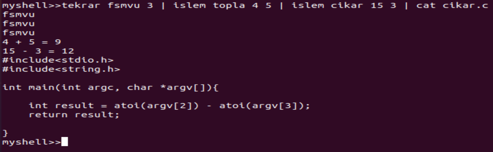

# Linux Shell Yazımı

Bu projenin konusu bir LINUX shell programı yazmaktır. Bu shell programının kendine özgü komutları, yanıtları, hata çıktıları olmalıdır. Bu shelle “myshell” denilecektir. Myshell programını “./myshell” olarak çalıştırınca terminal “Myshell” programına geçmelidir.

* Shell komut satırı “myshell>>” olarak görülmelidir. 

* “exit” komutu girilene kadar çıkış olamaz. Her seferinde “myshell>>” olarak yeni komut satırına izin vermelidir. 

* Eğer shellde olmayan bir komut, hatalı bir komut girilmişse (parametre hatası) ya da çağırılan programlarda bir hata olduğunda “yanlis bir komut girdiniz” demeli ve myshell tekrar komut alabilir hale gelmelidir. 

* “tekrar” olarak bir adet program yazılmalıdır bu myshellden bir adet string ve bir adet pozitif rakam parametresi almalıdır. Bu programın çağırılması sonucunda shell beklememeli sonucu çözüm gelince yazdırmalıdır

> myshell>> tekrar fatih 3  
> fatih    
> fatih  
> fatih  

* “islem” “topla” ve “cikar” olarak üç adet program yazılmalıdır. Bu programlardan “islem” diğer iki programı çağıracaktır. “islem” myshell’den 3 parametre alarak çalışmalıdır ve çıktıları myshell yazmalıdır. “islem” programı gelen parametreye göre prosese “topla” veya “cikar” programlarını yüklemelidir. Bu programların çağırılması fork ile yapılmalıdır ve programlar bitmediği sürece shell devam etmemelidir(wait). 

> myshell>> islem cikar 4 2  
> 4 - 2 = 2  

* Komutlar arasına “ | ” işareti kullanılarak komutlar sırayla işleyebilmelidir 

> myshell>> tekrar sultan 2 | islem topla 4 5  

* “cat yazi…” çıktı: “cat:yazi…”  

* “clear” ekran temizler.  

**Ekran Çıktıları**

  